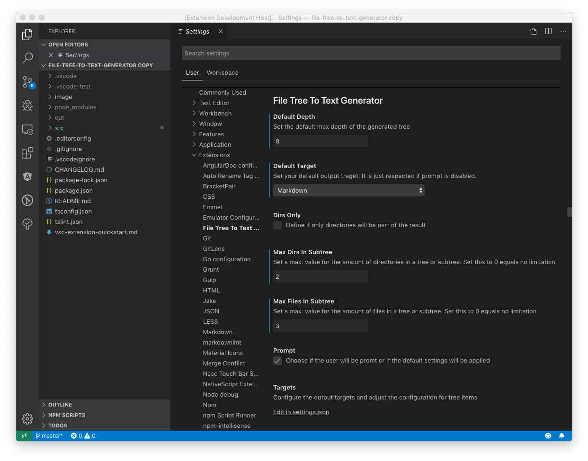

# file-tree-to-text-generator

[](https://marketplace.visualstudio.com/items?itemName=d-koppenhagen.file-tree-to-text-generator)
[](http://makeapullrequest.com)
[](https://github.com/ellerbrock/open-source-badge/)

<a href="https://www.buymeacoffee.com/dkoppenhagen" target="_blank"></a>

This extension will allow you to generate file / directory trees for different target formats.
Currently there are three supported default formats:

- Markdown
- LaTeX (DirTree)
- ASCII

If this formats doesn't fit your needs, you can customize them by adjusting the `settings.json` or by adding new formats.

## Features

### Basic usage

1. Install the extension
1. Right click on a directory inside the vscode file explorer and choose ("Generate Filetree...")
1. Choose your target format from the prompt
1. Choose the max depth or leave the output empty to get the whole tree from the choosen directory
1. The target code willl be generated and displayed in new tab now


### Configure via Extension Settings

You can easily set default values and even disable the promt.



currently available configuration options are:

- Set a default value for the max tree depth
- Define a default target for the output. This can be use in combination with the option `tree-generator.prompt` to directly generate an output.
- Use only directories for the output and do not include files
- Promt for options when generationg the tree
- Configure amd adjust the target formats
- limit the amount of files and/or directories in each subtree

### Configure a max. amount of files and / or directories for each subtree

You can define the max. amount of files and directories via vscode settings (`tree-generator.maxFilesInSubtree` and `tree-generator.maxDirsInSubtree`).
If there are more files or directories as defined, they will be replaced by an `...` entry. Setting the values to `0` means that there is no limit set.


### Exclude files / directories from the result

By default, the extension respects the glob exclude configuration `files.exclude` from the VSCode settings.
All matching files and directories matching those globs won't be part of the final result.
However, you can define specific globs that will extend / override the settings in this configuration just for the tree generator.
The configuration is an array ob glob definitions.

In the example below, you can see that the `node_modules` will be excluded globally.
But because the exclude setting for the same pattern in the local settings is disabled (`false`), the matching paths will be included in the result.

```json
{
  "files.exclude": {
    // ...
    "**node_modules": true
  },
  "tree-generator.exclude": {
    "**node_modules": false,
    "**some-path/**/*.exclude.me": true
  }
}
```

### Define custom generators or modify defaults

You can define custom generators or modify the default outputs by adjusting the configuration in you `settings.json` file.
The place for that is the `tree-generator.targets` array.


The `masks` property defines the main style for different kinds of entries (directories, files).
All props in `masks` will can use placeholders which will be replaces by the generator with the following contents:

- `#0` : Insert the tree level number (e.g. "2")
- `#1` : Insert the name of the file or directory (e.g. "myFile.txt" or "myDirectory")
- `#2` : Insert the relative path to the file or directory starting from the selected directory (e.g. "/src/someFile.txt" or "/src/someDirectory")

As an example the mask `#0: [#1](.#2)` will lead into `1: [file1.txt](./path/to/file/file1.txt)`.

```json
"tree-generator.targets": [
  // ...
  {
      "picker": {
          "label": "Markdown (Heading Style)",
          "description": "Convert to Markdown with files and directories as headings"
      },
      "beforeTree": "",
      "afterTree": "<br/>",
      "indent": "#",
      "masks": {
          "root": "# #1<br/><br/>[#1](.#2)<br/>",
          "file": {
              "default": "# #1<br/><br/>[#1](.#2)<br/>"
          },
          "directory": {
              "default": "# #1<br/><br/>[#1](.#2)<br/>"
          }
      }
  }
]
```


## Release Notes

See [Changelog](./CHANGELOG.md)
